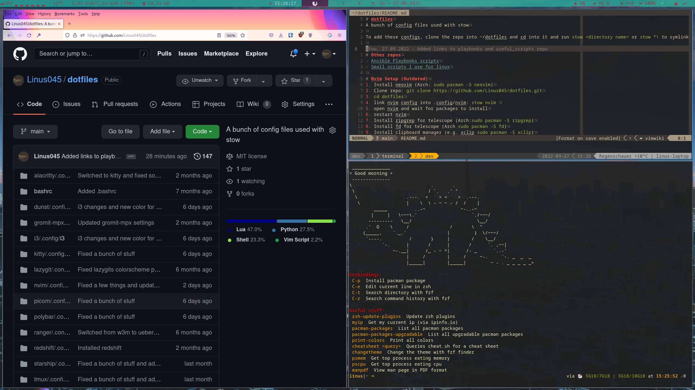

# dotfiles
A bunch of config files used with stow

To add these configs, clone the repo into ~/dotfiles and cd into it and run `stow -t ~ <directory name>` or `stow -t ~ *\` to symlink all directories into the respective place.
-t is required so it puts the files relative to the home directory /(where .config is located in my case).

# Other repos
- [Ansible Playbooks scripts](https://github.com/Linus045/playbooks)
- [Small scripts I use for linux](https://github.com/Linus045/useful_scripts)

# Nvim Setup (Outdated)
1. Install neovim (Arch: `sudo pacman -S neovim`)
2. Clone repo: `git clone https://github.com/Linus045/dotfiles.git`
3. `cd dotfiles`
4. link nvim config into .config/nvim: `stow nvim` 
5. open nvim and wait for packages to install
6. restart nvim
7. Install ripgrep for telescope (Arch:`sudo pacman -S ripgrep`)
8. Install fd for telescope (Arch `sudo pacman -S fd`)
9. Install clipboard manager (e.g. xclip `sudo pacman -S xclip`)
10. There might be other programs required for some keybindings, simply check the keymaps.lua file in lua/users/keymaps.lua
11. Open nivm and run `:checkhealth`

# Alacritty setup (Outdated, I use kitty now)
1. Install alacritty (Arch: `sudo pacman -S alacritty`)
1.2. (Restart system for drivers to update correctly)
2. Clone repo: `git clone https://github.com/Linus045/dotfiles.git`
3. `cd dotfiles`
4. link alacritty config into .config/alacritty: `stow alacritty`
5. Set alacritty as default terminal `export TERM=alacritty` in ~/.xprofile or similar

# zsh setup
1. Install zsh (Arch: `sudo pacman -S zsh`)
2. Clone repo: `git clone https://github.com/Linus045/dotfiles.git`
3. `cd dotfiles`
4. link zsh config into .config/zsh `stow zsh`
5. Set zsh home directory in ~/.xprofile or similar: `export ZDOTDIR=$HOME/.config/zsh`
6. Set zsh as default shell: `chsh -s /usr/zsh`
7. (Consider changing it as default shell for tty console as well see 'chsh' command help)
8. Log out and back in to see the change

# i3 setup
1. Install i3-gaps (Arch: `sudo pacman -S i3-gaps`)
2. Install rofi (Arch: `sudo pacman -S rofi`)
3. Install autotiling (Arch: `yay -S autotiling-git` Note: Needs python-pip)
4. Log out and change window manager to i3

# Polybar setup
1. Install polyabr (Arch: `sudo pacman -S polybar`)
2. Configure polybar see ~/.config/polybar files
  - Set Network interface
  - Set CPU temperatur device
  - Remove Battery module if not needed
3. Install fonts or replace them (e.g. Arch `sudp pacman -S ttf-iosevka-nerd` and reload fonts cache `fs-cache`)

Programs (partly used for polybar) and general other stuff
  - feh
  - dunst
  - picom
  - ranger
  - zshell/zsh
  - safeeyes
  - alacritty
  - i3lock
  - rofi
  - i3 autotiling
  - lazygit
  - pulseaudio
  - wal-theme-picker
  - wal
  - cz-cli (https://github.com/commitizen/cz-cli)

# Setup Preview

